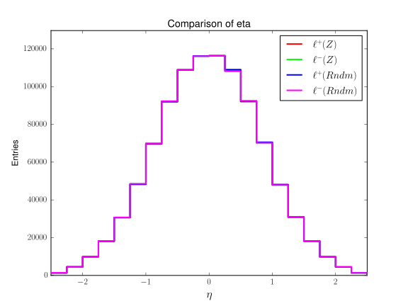
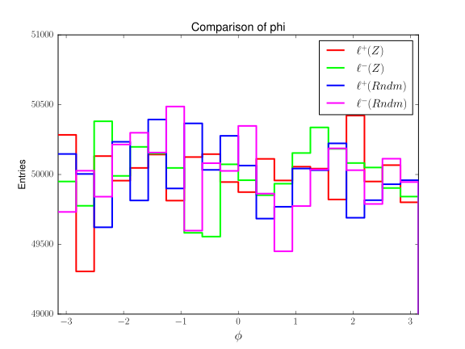
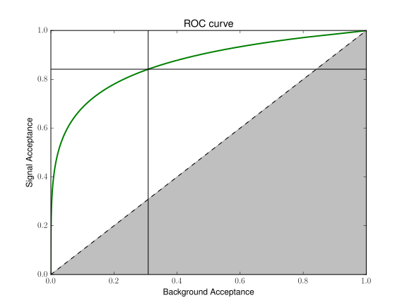

# Contents

[Introduction](#Introduction)

[Installation and Setup](#Installation-and-Setup)
- [Setup on lxplus](#Setup-on-lxplus)
- [Setup on the UTA-HEP cluster](#Setup-on-the-UTA-HEP-cluster)
- [Keras setup](#Keras-setup)
- [DLKit](#DLKit)
- [Event Classification with DNNs](#Event-Classification-with-DNNs)
- [Plotting](#Plotting)

[Z -> ll Topology](#Z--%3E-ll-Topology)
- [Sample Generation](#Sample-Generation)
- [Data Give to DNN](#Data-Given-to-DNN)
- [What a Human Would Do](#What-a-Human-Would-Do)
- [Training the Model](#Training-the-Model)
- [Analyzing Results](#Analyzing-Results)
- [Suggested tinkering for Zll topology](#Suggested-tinkering-for-Zll-topology)

[SUSY bbll+MET Topology](#SUSY-bbll+MET-Topology)
- [Observable-Scaling](#Observable-Scaling)
- [Field Selections](#Field-Selections)
- [Training and Analysis](#Training-and-Analysis)
- [Suggested tinkiner for SUSY topology](#Suggested-tinkering-for-SUSY-topology)

[Testing your own samples](#Testing-your-own-samples)

[Appendix](#Appendix)
- [Deep Learning](#Deep-Learning)
- [Software](#Software)
- [Classification Task](#Classification-Task)
- [Receiver Operating Characteristic](#Receiver-Operating-Characteristic)
- [Optimization](#Optimization)

# Introduction

This document outlines a tutorial study of a Deep Neural Network (DNN).

Event Classification is probably the easiest and most common use of multivariate techniques in High Energy Physics. In this tutorial, we will train Deep Neural Networks (DNNs) to discriminate between different types of events based on various input observables. We will first run an existing example problem on a prepared dataset, separating a $Z \rightarrow \ell\ell$ topology from noise, and then separation between different $bb\ell\ell+E_\mathrm{T}^{miss}$ topologies. We will then show you how to adapt the tutorial to any signal or background sample you have in ROOT format. Since time is short, we will likely only be able to finish the first part. Also, since lxplus odes not have access to GPUs, training times will be prohibitively long for us to train a performant DNN during the tutorial session.

The tutorial will allow you to compare different choices of variables, which you can use to demonstrate a common observation of DNNs to HEP event classification: DNNs training on four-vectors can perform better than DNNs trained on commonly used observables (masses, angles, etc), suggesting that there is discriminating information that is not encapsulated in the common variables. The tutorial also provides you a means of performing hyper-parameter scans, which entails training DNNs with different architectures to find an optimal configuration for your problem. Finally, the DNN in this tutorial is setup as a [parameterized classifier](https://arxiv.org/pdf/1601.07913.pdf), which, in cases where signal parameters are not known (e.g. the masses of the particles), allows you to train an optimal network for any signal point in parameter space. 

# Installation and Setup

This tutorial relies on:
- [Python 2](https://www.python.org/)
- [ROOT](https://root.cern.ch/)
- (optional) [RestFrames](http://restframes.com/)

In addition, you will need some python packages:
- [numpy](http://www.numpy.org/)
- [h5py](http://www.h5py.org/)
- [theano](http://www.deeplearning.net/software/theano/)
- [keras](https://keras.io/)
- [rootpy](http://www.rootpy.org/)
- [scikit](http://scikit-learn.org/stable/index.html)
- (optional) [root_numpy](https://rootpy.github.io/root_numpy/)
- (optional) [hPyROOT](https://github.com/dbullockphd/hPyROOT)

If you have not done so already, clone the repository:


```bash
git clone https://github.com/dbullock1086/DNNTutorial
cd DNNTutorial
```

## Keras setup

In order to run Keras, you will need to create two files in your home directory with the following contents

`~/.keras/keras.json`


```python
{
    "image_dim_ordering": "tf", 
    "epsilon": 1e-07, 
    "floatx": "float32", 
    "backend": "theano"
}
```

`~/.theanorc`


```bash
[global]
device = cpu
floatX = float32
force_device=True
[gcc]
cxxflags=-march=corei7
```

## Setup on lxplus

We will need to use some non-ATLAS software on lxplus. You can install this software, which takes about 15 minutes, or use one installed by someone else. The two options are given below.

### Option 1: Using pre-built installation

To use the prebuilt install, edit the `setup_lxplus.sh` file. The `UserWork` variable should be changed to your `DNNTutorial` directory. Then source the script:


```bash
source setup_lxplus.sh
```


```bash
export PATH="/afs/cern.ch/work/r/reece/public/miniconda3/bin:$PATH"
```

Then we need to add two files to your home area. Follow the instructions under Keras setup to create these two files: `~/.keras/keras.json` and `~/.theanorc` and then come back here.

Once that's done, now do:


```bash
cd /afs/cern.ch/work/r/reece/public/miniconda3/pkgs/root-6.04-py2.7_gcc4.8.2
source bin/thisroot.sh
cd ../back/to/../workarea
source activate testenv
```

After that, let's test that you get python 2.7 with no problems if you call the following


```python
import rootpy
import keras
```

### Option 2: Full installation

**Note:** This section is here for reference. If you are in the tutorial with limited time, consider using the first setup option above.

We will follow the instructions on [MLSoftwareStandAloneSetup](https://twiki.cern.ch/twiki/bin/view/AtlasComputing/MLSoftwareStandAloneSetup), but we'll step through them below.

Login to lxplus and navigate to a workarea with several GB of available space (a good place to do this is in your "Workspace" which is located somewhere like `/afs/cern.ch/work/l/lheelan/public/` which can have up to 100 GB of space). We will refer to this workarea directory as `workarea below`. Now we will install the necessary packages through conda:


```bash
cd workarea
wget https://repo.continuum.io/miniconda/Miniconda3-latest-Linux-x86_64.sh
sh Miniconda3-latest-Linux-x86_64.sh
```

Press `enter`, approve license (`yes`), change the installation path of Miniconda3 to:


```bash
workarea/miniconda3
```

**Note:** The default is to install it to your `/afs/cern.ch/user/` space, which is not what we're suggesting here.

Do not prepend the `PATH` to your login shell. Instead, put it in your `setup.sh` file.

Logout of lxplus, and log back in.


```bash
conda config --add channels https://conda.anaconda.org/NLeSC
conda create --name=testenv root=6 python=2 mkl jupyter numpy scipy matplotlib scikit-learn h5py rootpy root-numpy pandas
```

When prompted, proceed (`yes`). This installation will take about 15 minutes.

Continuing on...


```bash
source activate testenv
pip install Theano
pip install Keras
```

During the install, it will ask you it you want to add conda to your path in you `.bashrc`. Again, it is better to keep this in `setup.sh`.

If you start a new login session, make sure conda is in your path, and:


```bash
cd miniconda3/pkgs/root-6.04-py2.7_gcc4.8.2
source bin/thisroot.sh
cd ../back/to/../workarea
source activate testenv
```

## Setup on the UTA-HEP cluster

Edit the `setup_uta.sh` file. The `UserWork` variable should be changed to your `DNNTutorial` directory. Then source the script:


```bash
source setup_uta.sh
```

The instuctions in this subsection are specific to the HEP computing cluster at the University of Texas at Arlington. The main difference to setting up at UTA is that one of its purposes is to support DNN jobs with GPUs. If you have a computing cluster, the instructions may be vaguely similar, but consult the people managing your cluster for details.


```bash
source /setups/setup_virtualenv.sh
source /setups/setup_cuda-8.0.sh
source /setups/setup_root.sh
mkvirtualenv keras
```


```bash
pip install keras
pip install rootpy
pip install h5py
pip install matplotlib
pip install sklearn
```

**Note:** If keras throws an error about not finding tensor flow, the `backend` key in ~/.keras/keras.json must be set to `theano`

Every time you want to work with keras, you need to setup your environment for your keras install after login:


```bash
source /setups/setup_virtualenv.sh 
source /setups/setup_cuda-8.0.sh 
source /setups/setup_root.sh 
workon keras
```

## DLKit

Keras is actually very simple to use and there are plenty of nice tutorials and examples out there for you to learn from and build on. DLKit is a very lightweight wrapper that makes it easy to try lots of different DNN models, save and retrieve them, run them on a batch system, etc. Also, it makes it easier to build standalone Deep Learning examples that all use the same basic infrastructure. You are welcome to use Keras directly. Over time, you’ll probably build something that resembles DLKit to help you do stuff.

Let’s checkout DLKit:


```bash
git clone https://bitbucket.org/anomalousai/DLKit
cd DLKit
```

## Event Classification with DNNs

The tutorial is set up for a specific classification task, which we will first run, and then adapt to a another classification task using another dataset.


```bash
git clone https://github.com/UTA-HEP-Computing/EventClassificationDNN
```

`EventClassificationDNN/Experiment.py` is the “experiment” that drives everything. Let’s go through the stages of the experiment:
1. Parse the arguments
2. Parse the Configuration
3. Load the data<br>
a. Select data samples/classes<br>
b. Select input variables<br>
c. Normalize the data<br>
7. Load or Build the Model
8. Train
9. Assess the performance

Let's preview the task we are about to run:


```bash
python -m EventClassificationDNN.Experiment --help
```

Using the various command line switches, you can turn different steps on and off, allowing you to perform different types of tasks. For example, if you have already trained a model but wish to remake the plots, you can use the `-L` switch to load the model, and `--NoTrain` to skip the training. And if you want to train longer, you can load a model that has already been trained.

There are several other scripts that are called by `Experiment.py`:

`EventClassificationDNN/Arguments.py`: This is the file where all of the above arguments are defined and parsed. You can add your own options here if need be.

`EventClassificationDNN/ZllConfig.py`: This is a configuration file. The model and experiment parameters are set here. This configuration (or `SUSYConfig.py`) is the one you are most likely going to edit. The others are reserved for development tweaks.

`EventClassificationDNN/MultiClassTools.py`: This is the tool that reads the h5 files and creates the training and testing datasets.

`EventClassificationDNN/Classification.py`: This contains the keras model, wrapped in a DLKit `ModelWrapper` class.

`EventClassificationDNN/Analysis.py`: This contains the analysis that is performed at the end to see how well we did.

`EventClassificationDNN/CSVWriter.py`: This dumps the results in a format readable to most software.

Our DNN architecture is defined by the types, number, and dimension of layers. Hyper-parameter scanning refers to the process of searching for an optimal architecture that performs well for a task and can be trained and applied within reasonable time. Beyond the parameters that define the DNN architecture, other configuration parameters allow setting and testing activation and cost functions, optimization (e.g. minimization) techniques, and rate other training parameters.

In DLKit, these parameters are set in a configuration file, which defines a single python key/value dictionary called `Config`. DLKit puts the contents of this dictionary in the global scope with the keys as the variable names. As an example, see line 40 of `ZllConfig.py`: 


```python
Config = {'MaxEvents':    50000,
          'Epochs':       1000,
          'BatchSize':   2048*8,
          'LearningRate': 0.005,
          'Decay':           0.,
          'Momentum':        0.,
          'Nesterov':        0.,
          'arrType': np.float32,
          'WeightInitialization':"'normal'"}
```

Note that the max events is per data sample and not over the whole training set. It would be cumbersome to generate a new configuration file for every network we would like to try. Instead, `ZllConfig.py` uses a second dictionary to specify parameters that you would like to scan, and the `DLTools.Permutator` class generates all possible configurations of the parameter. For example, on line 50:


```python
Params = {'Width': [1585, 100],
          'Depth': [1],
          'loss': ["'categorical_crossentropy'"]}
```

Notice that these parameters are given as lists. You can specify more than one value for these parameters and can access any combination of them. By default, the combination is chosen at random. You can force a combination by adding the `-s` tag and the (flat) index number for the combination.

## Plotting

After running the DNN study, the results are stored in a comma-separated value (CSV) file. The choice of how to analyze this file is up to you. This can be accomplished with matplotlib, h5py, PyTables, pandas, and many other common packages (also Julia, R, Matlab, gnuplot, etc... even Excel). However, another package was written in parallel with early testing for this tutorial called hPyROOT. The example scripts in this tutorial for analyzing the output file rely on this package, but this is an optional recommendation.

If you are working on UTA-HEP or lxplus, the setup files will make an existing source for hPyROOT available. Otherwise, clone the repository for yourself:


```bash
cd ..
git clone https://github.com/dbullockphd/hPyROOT
cd DLKit
```

---

# Z -> ll Topology

## Sample Generation

The sample used for this topological classification was generated using [RestFrames](http://restframes.com/). If you have sourced the setup file appropriate to your working environment, this sample can be found in `$SampleDirZll`.

The signal topology models a $Z$ boson with a random small boost decaying into two leptons of opposite charge. These leptons are designated as `LP` ($\ell^+$) and `LM` ($\ell^-$). Four-vectors for the two leptons can be fully reconstructed using the $p_\mathrm{T}$, $\phi$, $\eta$, and $E$. The dataset name is recorded as `Zto2LOS`.

The "background" model does not follow a specific topology. In order to keep this tutorial example simple, it was decided that only one observable should be noticeably different. Cuts to energy scale would be a bit too obvious, so $p_\mathrm{T}$ did not seem appropriate. Cuts to $\eta$ would be a difficult concept to translate to the typical transverse analysis in HEP. Therefore, the "background" sample is generated by randomizing the $\phi$ of the $Z \rightarrow \ell\ell$ topology for each event. This is meant to simulate an event that produces two leptons by some uncorrelated process. The dataset name is recorded as `Rndm2LOS`.

### (optional) How these samples were generated

You can generate these samples on your own if you want. This will need ~ 110 MB of additional space, although you only need to keep one of the two sample files (the `.h5` one). The script used to generate the file is `examples/gen_Zll.C`, which relies on the [RestFrames](http://restframes.com/) package.


```python
.x gen_Zll.C
```

This will output a dataset in ROOT format, and was converted to HDF5 using `root2hdf5` (which comes with the `rootpy` package). While this conversion utility can handle some complex ROOT data types, we used flat `TTrees` with simple types which produces very predictable HDF5 format.


```bash
root2hdf5 studyZll.C
mv studyZll.root $SampleDirZll/Zll.h5
```

## Data Given to DNN

The data file and datasets are input into the DNN by using `ZllConfig.py`. Line 2 can be a list of files, but it is just one file for this example. Line 9 handles the individual datasets. These would be similar to the names of `TTree`s in a ROOT file. The individual datasets represent the possible classifications. For example, if there were split input files, they could be combined such that datasets named `Zto2LOS` are all chained together and all `Rndm2LOS` datasets are chained together.

In the input data file, there are only two objects: `LP` and `LM`. These two objects are only specified by their four-vector components:
- $p_\mathrm{T}$
- $\phi$
- $\eta$
- $E$

This exercise will demonstrate the performance of the DNN using raw information. Because of the way the samples were generated, most of these values will be identical.

Transverse momentum:


Pseudo-rapidity:



Energy:


The exception is in the azimuthal angle:



**Note:** In a real sample, there would be some variability in the other distributions as well. This pseudo-data is only meant to show a DNN finding classification features from a familiar interaction.

## What a Human Would Do

A human might find it exceedingly difficult to find the pattern in the above distribution for $\phi$. Instead, you might be inclined to look at the problem in 2D:

 

These plots are comparing the $\phi$ of the positively-charged lepton with the negatively-charged lepton. In the $Z \rightarrow \ell\ell$ case (first plot), the leptons are mostly contralinear. In the randomized data, there is no clear pattern.

Since this indicates a difference that appears to be related to whether the radiation is contralinear, another viable option is the azimuthal angle between the two leptons:


For this example, $\Delta \phi$ might be good enough. However, in practice, this would not be utilizing all the available information. If we looked at the invariant mass, we would have more observables to work with:

$$
M_{\ell\ell} = m_{\ell 1}^{2} + m_{\ell 2}^{2} + 2[E_\mathrm{T}(\ell 1)E_\mathrm{T}(\ell 2) - \vec{p}_\mathrm{T}(\ell 1) \cdot \vec{p}_\mathrm{T}(\ell 2)]
$$


But this still ignores the longitudinal component of the events. The derived variables, although aesthetically fit for human readability, may be shedding some information. In a general example (not specifically tailored for a tutorial), the raw four-vectors could potentially contain enough extra information to make a better determination and improve selection criteria. Therefore, although derived variables *can* be constructed from the raw data, they are not explicitly given to the DNN to avoid biasing the results. After the DNN completes its training, we can compare the results to what we know works.

### (optional) How these  derivation plots were made

The plots in this section were created using [hPyROOT](https://github.com/dbullockphd/hPyROOT). If you would like to recreate them for yourself, make sure you follow the instructions for setting up hPyROOT (see the github repository for more detail on how hPyROOT works).

**Note:** This script is also available in `examples/make-raw.py`.

hPyROOT jobs will all start with importing the necessary modules and objects:


```python
import os # access to environment variables
from eventloop.Driver import * # this collects all job info
from eventloop.EventStore import * # this will evaluate expressions involving data
from pyobjects.LorentzDef import * # create a four-vector directly from data
```

To facilitate calculating new observables from raw four-vectors, we need two algorithms:


```python
from elalgs.InvMass import * # calculate invariant mass
from elalgs.DeltaPhi import * # calculate azimuthal angle
```

And we want to be able to write these calculated variables as histograms in a ROOT file:


```python
from elalgs.HistFill import * # histogram filling
```

Because there are two datasets in the HDF5 file and we want to represent *both*, we use a `for` loop:


```python
for study in ['Zll', 'Rndm']:
    print '*'*64
    print 'PERFORMING STUDY:', study
    print '*'*64

    if study == 'Zll': tname = 'Zto2LOS'
    else: tname = 'Rndm2LOS'
```

Now we initialize the `Driver` and set the I/O:


```python
    driver = Driver ('raw' + study)
    driver.Input (os.getenv('SampleDir') + '/Zll.h5', tname)
    driver.Output (os.getenv('HistDir'))
```

hPyROOT supports creating expressions from an arbitrary construction of labels (columns) in the dataset. By defining a set of `pyobjects` and passing them to this `EventStore`, they can be evaluated for each event and are made available for subsequent algorithms to use them.


```python
    estore = EventStore ('estore')
```

You can define four-vectors by component, and these components are updated per event.


```python
    LP = LorentzDef ('LP',
                     ['LP_pT', 'LP_eta', 'LP_phi', 'LP_E'],
                 mode='ptetaphie')
    estore.AddVar (LP)

    LM = LorentzDef ('LM',
                     ['LM_pT', 'LM_eta', 'LM_phi', 'LM_E'],
                     mode='ptetaphie')
    estore.AddVar (LM)
```

Once you have all the objects you need, add the `EventStore` to the `Driver`.


```python
    driver.Alg (estore)
```

We use an algorithm to calculate the invariant mass and $\Delta\phi$ from 2 four-vectors.


```python
    Mll = InvMass ('Mll', 'LP', 'LM')
    driver.Alg (Mll)

    DPhi = DeltaPhi ('DPhi', 'LP', 'LM')
    driver.Alg (DPhi)
```

Then use these new variables to fill histograms. We have 2D histograms of $\phi$ for the two objects:


```python
    h_LPphi_LMphi = HistFill ('h_LPphi_LMphi',
                              'LP_phi', 20, -3.1416, 3.1416,
                              'LM_phi', 20, -3.1416, 3.1416)
    driver.Alg (h_LPphi_LMphi)
```

And 1D histograms of invariant mass and $\Delta\phi$.


```python
    h_InvMass = HistFill ('h_Mll',
                          'Mll', 20, 0, 200)
    driver.Alg (h_InvMass)

    h_DPhi = HistFill ('h_DPhi',
                       'DPhi', 20, 0, 3.1416)
    driver.Alg (h_DPhi)
```

Once the job is properly configured, submit it.


```python
    driver.Submit ()
    pass
```

After the script is done, you should have a new ROOT file that contains your filled histograms. You can examine the file yourself, or use matplotlib/rootpy to save the figures.

**Note:** This script is also available in `examples/save-raw.py`.

Start by importing these modules:


```python
import os
from matplotlib import pyplot as plt
from rootpy.plotting import root2matplotlib as rplt
from rootpy.io import root_open
```

Remember that we have two classifications to view:


```python
hists = {}
for a in ['Zll', 'Rndm']:
```

Open the ROOT file:


```python
    f = root_open('raw%s.root' % a)
```

We have three histograms from each classification:


```python
    hists[a] = {}
    for b in ['LPphi_LMphi',
              'Mll', 'DPhi']:
```

Load the histograms into memory and rename to avoid conflicts:


```python
        hists[a][b] = f.Get('h_%s' % b)
        hists[a][b].SetDirectory(0)
        hists[a][b].SetName('%s_%s' % (a,b))
```

Give the histograms a little style:


```python
        if b in ['Mll', 'DPhi']:
            if a == 'Zll':
                title = r'$Z \rightarrow \ell\ell$'
                color = 2
                pass
            else:
                title = r'$Rndm \rightarrow \ell\ell$'
                color = 4
                pass
            hists[a][b].SetTitle(title)
            hists[a][b].SetFillColor(color)
            hists[a][b].SetLineWidth(2)
            hists[a][b].SetLineColor(color)
            hists[a][b].SetMarkerColor(color)
            pass
```

And close the files:


```python
        pass
    f.Close()
    pass
```

Show the 2D histograms:


```python
for a in ['Zll', 'Rndm']:
    print a, 'LPphi_LMphi'
    fig, ax = plt.subplots()
    ax.set_title(r'Comparison of $\ell_\phi$')
    ax.set_xlabel(r'$\ell_{\phi}^{+}$', fontsize=16)
    ax.set_ylabel(r'$\ell_{\phi}^{-}$', fontsize=16)
    hdraw = rplt.imshow(hists[a]['LPphi_LMphi'])
    cb = fig.colorbar(hdraw)
    plt.show()
    pass
```

Show the 1D histograms:


```python
for b in ['Mll', 'DPhi']:
    print b
    fig, ax = plt.subplots()
    ax.set_title('Comparison of %s' % b)
    if b == 'Mll': ax.set_xlabel(r'$M_{\ell\ell}$', fontsize=16)
    else: ax.set_xlabel(r'$\Delta\phi$', fontsize=16)
    ax.set_ylabel('Entries')
    for a in ['Zll', 'Rndm']: rplt.hist(hists[a][b])
    ax.legend(loc=2)
    if b == 'Mll':
        plt.plot([91.1876,91.1876], ax.get_ylim(), 'k')
        ax.text(95, 325000, r'$M_{\ell\ell}=m_{Z}$', fontsize=16)
        pass
    plt.show()
    pass
```

## Training the Model

The task is nearly ready to run already. The particular configuration file we want to run is `EventClassificationDNN/ZllConfig.py`. The last thing that we need to consider is how to optimize the study. The exact method for determining the best parameters is outlined in the [Optimization](#Optimization) section. The optimization has been tested on two systems:
- On lxplus: Width = 100, Depth = 1, Epoch = 1000
- On the UTA-HEP cluster: Width = 1585, Depth = 1, Epoch = 1000

In the configuration file, these values are kept in the following lines:
- Epoch on line 41
- Width on line 50
- Depth on line 51

However, leave them as they are on your first try. We can use the `-s` flag to access the pre-defined parameters. There are other important parts of the configuration file to consider, but we will leave them to the [SUSY model](#SUSY-bbll+MET-Topology).

**Note:** You could set the epoch as high as you want. The general rule is that a higher number of epochs *does* mean better classification results, but at the expense of increasing the amount of time spent on training. Also in general, the relationship between classification performance and the number of epochs is uncertain after the random learning converges; you could find that you are spending a lot of time for very little extra gain.

### Training on lxplus

**Note:** This could take a while (~ 35-40 minutes). Consider reviewing some of the appendices while you wait, since they will help make sense of the results.

From the `DLKit` directory, the command for training is (notice the `cpu` flag):


```bash
python -m EventClassificationDNN.Experiment --config EventClassificationDNN/ZllConfig.py -s 1 --cpu
```

### Training on the UTA-HEP cluster

**Note:** This doesn't take long (~ 7-8 minutes) because of the GPU acceleration. It may be reasonable to increase the number of epochs if you like, or you can also try the [SUSY model](#SUSY-bbll+MET-Topology) below after you are done. Consider reviewing some of the appendices while you wait, since they will help make sense of the results.

From the `DLKit` directory, the command for training is:


```bash
python -m EventClassificationDNN.Experiment --config EventClassificationDNN/ZllConfig.py -s 0
```

**Note:** You get the most timely results when running alone. If there are other people working on the cluster simultaneously, you may be competing for resources. Please coordinate with each other and use the `--gpu` flag with an index to specify which processor you want to use.

## Analyzing Results

After the model has been trained, it creates a new directory in `TrainedModels`. This directory name looks like `ZllModel_0`, with the "underscore zero" indicating that the model analyzed the first variable set (which will be used in the [SUSY model](#SUSY-bbll+MET-Topology) below). If you have been running the training model multiple times, you may also see a `.1` or `.2` (etc.) indicating the trial number since the package does not overwrite training results.

Inside the directory, you will find a number of files:
- `MetaData.pickle` - a file that stores some objects to recall if you want to load the model again
- `Model.json` - the configuration that was used to define the parameters of the model
- `Result.csv` - a sample of data appended with a column for a predictied classification of each event and its true classification
- `ROC.pdf` - a [ROC curve](#Receiver-Operating-Characteristic) image of the results
- `Weights.h5` - a file containing the DNN's internal construct for determining the relative and conditional importance of each observable

Looking at the ROC curve is helpful for determining the performance of the DNN. If you had a target acceptance rate in mind, you will want to examine this ROC curve. Otherwise, you might actually be interested in the multivariate "contour" contained in `Result.csv`.

In preparation for this tutorial, the results were obtained on the UTA-HEP cluster for a variable number of epochs:
- 100
- 1000
- 10000
- 100000

This allows us a chance to examine the learning process of the DNN.

### ROC curves

To get a sense of how well the DNN performed overall, we look at the [ROC curves](#Receiver-Operating-Characteristic) to study the classifications.

For one hundred epochs:


The $Z \rightarrow \ell\ell$ classification is shown in red and the $Rndm \rightarrow \ell\ell$ classification is in orange. Notice that this means the terms "signal" and "background" are swapped depending on which curve you are looking at. Since they are inverted selections, you can safely look at only the red curve.

This is still an early prediction from the DNN. There is some noticeable separation from the diagonal, but the background contamination is still quite high for a good signal acceptance. Near the bottom-left corner, the curve even dips below the diagonal. This would be a major concern if the signal events were very rare compared to the background: at *low* background contamination, the prediction is actually favoring a selection of *background* events. We should try more epochs.

For one thousand epochs:


It may be difficult to notice, but this *is* a new figure (even with the same AUC values). The separation from the diagonal is just a *little* better. The DNN has not learned much even with 900 more epochs. But be patient...

For ten thousand epochs:


Now, not only is the separaton even better, but the curves also do not dip below the diagonal. The red curve still favors a selection that has a large background acceptance. This condition is manifested as the rightward "slant" in the curve.

For one hundred thousand epochs:


The curve appears to be more symmetrical (not "slanted" as before). If you were interested in orthogonal cuts between signal and background, you could use this curve to set your selections. However, our purpose in training a DNN is to identify features, so we also look at its predictions.

### Predicted Features

The `Result.csv` is the real file of interest. It can be used to study the features that the DNN has identified. It's not always easy to identify exactly what relationship was found between the observables in raw data since what it found was a piecewise conditional dataset. This is why the $Z \rightarrow \ell\ell$ example was chosen first, because it's not a big mystery about what the DNN might find; we already know invariant mass and $\Delta\phi$ are going to do quite well. Our conditional selections are *probabilistic* based on the value of observables in each event. In other words, we can think of the classification features as a "tag" with an associated certainty.

First, we will examine what it learns from $\Delta\phi$. For one hundred epochs:


**Note:** Reading this plot can be tricky when you first see it. The "red shift" does **not** mean that the DNN has identified these *values* (horizontal axis) to be more signal-like. Instead, the prediction strength will be visible on the *vertical* axis, with bins near the top indicating strong positive prediction and bins near the bottom indicating strong negative prediction. The colors are there just to indicate the number of events that are predicted to occupy that bin. In an idealized classification problem with a perfectly-suited discriminant (horizontal axis), the plot would consist of two red lines: 0% on the left and 100% on the right. If the problem is less discrete, then the green/blue bins indicate a non-zero chance.

The DNN quickly finds that events near $\Delta\phi = \pi$ are predominantly signal events. However, it is not very confident of what percentage of events belong in either classification. Since the DNN defaults to 50% (a "coin flip"), this is barely better than plain confusion.

For one thousand epochs:


Now the DNN can see that there are an abundance of events at low $\Delta\phi$, and a higher percentage of them are background. However, most values near $\Delta\phi = \pi$ are still less than about 60% prediction. We can see that the corresponding ROC curves may have been misleading, because these two distributions really do look different.

For ten thousand epochs:


The DNN begins to increase its confidence that values near $\Delta\phi = \pi$ are significant. This demonstrates that the DNN is on the right track to identifying the difference between samples.

For one hundred thousand epochs:


At this point, the DNN is now increasing its specificity. For example, now it is quite sure that events in $\Delta\phi = [0,\pi/2]$ are background events, and then the prediction begins to shift toward signal classification. Notice that a greater percentage of bins now have some kind of prediction.

What about for the invariant mass? For one hundred epochs:


For one thousand epochs:


For ten thousand epochs:


And for one hundred thousand epochs:


The pattern is similar to the learning behavior of $\Delta\phi$.

### Evaluating Performance

These features are just *predictions* of real features. It still remains to be shown that these features are accurate representations of the data. For that reason, we also look at the prediction rate versus truth.

For one hundred epochs:


The results are still very inconclusive. The 50% prediction rate still loses ~ 1/3 of the real signal events. However, the number of background events that have slipped through the prediction is also high.

For one thousand epochs:


The prediction rate aligns more closely with the truth value, but the rejection of background is still vague.

For ten thousand epochs:


We can see the DNN is on the verge of finding a good separation, but the false rate is still a little concerning.

For one hundred thousand epochs:


This plot finally shows something that you can use to pick a stable contour. At ~ 55% to 60% prediction rate, most events *really are* background. You can be confident that rates above this level are selecting signal events. In fact, for a cut of 57% on prediction rate, the "tag" is 72% signal events.

### (optional) How these feature plots were made

You can create these plots yourself again using hPyROOT. The output file is in CSV format because of its compatability with many software environments. hPyROOT includes an executable that converts the file to ROOT or HDF5 format, which are better protected from tampering. Execute the following:


```bash
convert-csv $TrainDir/ZllModel_0/Result.csv
```

Now that the result file is in the HDF5 format, we can use hPyROOT.

**Note:** This script is also available in `examples/make-results.py`.
    
We begin by importing the necessary modules and objects:


```python
import os # access to environment variables
from eventloop.Driver import * # this collects all job info
from eventloop.EventStore import * # this will evaluate expressions involving data
from pyobjects.LorentzDef import * # create a four-vector directly from data
```

To facilitate calculating new observables from raw four-vectors, we need two algorithms:


```python
from elalgs.InvMass import * # calculate invariant mass
from elalgs.DeltaPhi import * # calculate azimuthal angle
```

And we want to be able to write these calculated variables as histograms in a ROOT file:


```python
from elalgs.HistFill import * # histogram filling
```

Now we initialize the `Driver` and set the I/O:


```python
driver = Driver ('studyZll')
driver.Input (os.getenv('TrainDir') + 'ZllModel_0/Result.h5', 'tree')
driver.Output (os.getenv('HistDir'))
```

hPyROOT supports creating expressions from an arbitrary construction of labels (columns) in the dataset. By defining a set of `pyobjects` and passing them to this `EventStore`, they can be evaluated for each event and are made available for subsequent algorithms to use them.


```python
estore = EventStore ('estore')
```

You can define four-vectors by component, and these components are updated per event.


```python
LP = LorentzDef ('LP',
                 ['LP_pT', 'LP_eta', 'LP_phi', 'LP_E'],
                 mode='ptetaphie')
estore.AddVar (LP)

LM = LorentzDef ('LM',
                 ['LM_pT', 'LM_eta', 'LM_phi', 'LM_E'],
                 mode='ptetaphie')
estore.AddVar (LM)
```

Once you have all the objects you need, add the `EventStore` to the `Driver`.


```python
driver.Alg (estore)
```

We use an algorithm to calculate the invariant mass and $\Delta\phi$ from 2 four-vectors.


```python
Mll = InvMass ('Mll', 'LP', 'LM')
driver.Alg (Mll)

DPhi = DeltaPhi ('DPhi', 'LP', 'LM')
driver.Alg (DPhi)
```

Create 2D histograms:


```python
h_InvMass = HistFill ('h_Mll',
                      'Mll', 20, 0, 200,
                      'predict_0', 21, 0, 1.05)
driver.Alg (h_InvMass)

h_DPhi = HistFill ('h_DPhi',
                   'DPhi', 20, 0, 3.1416,
                   'predict_0', 21, 0, 1.05)
driver.Alg (h_DPhi)

h_perf = HistFill ('h_perf',
                   'predict_0', 21, 0, 1.05,
                   'true_0', 2, 0, 2)
driver.Alg (h_perf)
```

And submit once you're done:


```python
driver.Submit ()
```

After the script is done, you should have a new ROOT file that contains your filled histograms. You can examine the file yourself, or use matplotlib/rootpy to save the figures.

**Note:** This script is also available in `examples/save-resulta.py`.

Start by importing these modules:


```python
import os
from numpy import nan
from matplotlib import pyplot as plt
from rootpy.plotting import root2matplotlib as rplt
from rootpy.io import root_open
```

Open the ROOT file:


```python
f = root_open(os.getenv('HistDir') + '/studyZll.root')
```

We have two derived features to examine:


```python
for p in ['Mll', 'DPhi', 'perf']:
```

Get a histogram:


```python
    h = f.Get('h_%s' % p)
```

By default, empty bins will be drawn as if their content is zero. This can be problematic since it can imply that these conditions are equivalent. However, when the DNN decides that a low number of events from one bin are predicted to be signal events, this is *not* the same as saying that the DNN did not have commentary for an individual bin. For that reason, we can assign bins with zero content -- assuming that *exactly* zero events can represent statistical outliers due to random sampling -- to Not a Number. By doing this, we ensure the color scheme is disjointed between a low number of events (blue) and empty/zero (white). This is simply a graphical choice.


```python
    for x in xrange(h.GetNbinsX()):
        for y in xrange(h.GetNbinsY()):
            if not h.GetBinContent(x+1, y+1): h.SetBinContent(x+1, y+1, nan)
            pass
        pass
```

Now show the histogram:


```python
    fig, ax = plt.subplots()
    ax.set_title('DNN Result')
    if p == 'Mll': ax.set_xlabel(r'$M_{\ell\ell}$', fontsize=16)
    else: ax.set_xlabel(r'$\Delta\phi$', fontsize=16)
    ax.set_ylabel('Predicted Rate')
    hdraw = rplt.imshow(h)
    fig.colorbar(hdraw)
    if p == 'Mll':
        plt.plot([91.1876,91.1876], ax.get_ylim(), 'k')
        plt.plot(ax.get_xlim(), [0.5,0.5], 'k')
        plt.text(95, 0.95, r'$M_{\ell\ell}=m_{Z}$', fontsize=16)
        ax.set_ylim(0, 1.05)
        pass
    elif p == 'DPhi':
        plt.plot([0,3.5], [0.5,0.5], 'k')
        ax.set_ylim(0, 1.05)
        pass
    else:
        plt.plot([0,1.05], [1.0,1.0], 'k')
        ax.set_xlim(0, 1.05)
        pass
    plt.show()
    #plt.savefig(os.getenv('HistDir') + '/%s.svg' % p)
    pass
```

Close the file when you are done.


```python
f.Close()
```

## Suggested tinkering for Zll topology

This concludes the prepared part of the $Z \rightarrow \ell\ell$ topological study. You are welcome to continue tinkering with the configuration file. We suggest changing the width, depth, and epoch, and see how it affects your results. You can force the training to use a new width/depth/epoch by editing the existing configuration, or you can set a list of values and drop the `-s` option from the command line to let random chance decide the hyperparameter set. If you are working on lxplus, remember that each test you run could take a long time. Even on the UTA-HEP cluster, you may want to have something else to do while it runs and then analyze the results later.

Another idea you could try is to study whether the DNN has found a truly deterministic classification. Since both the production of the samples and the learning process itself are inherently probabilistic, you are not going to get *exactly* the same results. You can train over several trials and compare results. You can also try the suggested option of generating the topology yourself and then compare your results with the the new samples file. The model should also be able to isolate events from a combined sample of data (with both -- or unknown -- classifications).

---

# SUSY bbll+MET Topology

The $Z \rightarrow \ell\ell$ example shows how to separate signal from background. Your analysis groups may have other perferred ways to eliminate background events, so maybe you would rather train for optimizing your signal sensitivity. Rather than making cuts across an entire plane of signal models, it could be beneficial to isolate regions of similar decay topologies.

This second configuration is set up to study how well we can distinguish different SUSY decay topologies leading to the $bb\ell\ell + E_\mathrm{T}^{miss}$ final state. We train on samples of decays of SUSY-like particles ($P$). The $P$ particle can decay via a daughter particle ($C$) in 2 ways:
- "A": $P \rightarrow Cb$ and $C \rightarrow \ell\chi$
- "B": $P \rightarrow C\ell$ and $C \rightarrow b\chi$

Here. $\chi$ is a weakly interacting particle that escapes detection. For any given masses of $P$, $C$, and $\chi$, there are 4 possible types of event topologies depending on how each (RPC SUSY) of the $P$ particles decays:
- AA
- AB
- BA
- BB

Our task is to distinguish between these scenarios using different inputs. For this study, we fix the mass of the $P$ particle at 1 TeV, the mass of the $\chi$ particle at 100 GeV, and scan the $C$ particle mass between the $P$ and $\chi$ masses ([150, 950]).

The datasets from each sample file (`$SampleDirSUSY`) contain the SUSY particle masses that were used to generate the models:
- mP
- mC
- mX

They also contain four-vectors for two $b$-jets and two leptons:
- L1_pT ; L1_phi ; L1_eta ; L1_M
- L2_pT ; L2_phi ; L2_eta ; L2_M
- B1_pT ; B1_phi ; B1_eta ; B1_M
- B2_pT ; B2_phi ; B2_eta ; B2_M

They contain two-vectors for $E_\mathrm{T}^{miss}$:
- METx
- METy

This is the detector-level information. Unfortunately, the cumulative distributions of each observable are identical. We are unable to show a 2D histogram that conveniently makes their relationship obvious because there are five reconstructed objects (for six real particles). We choose a selection of [Recursive Jigsaw](https://cds.cern.ch/record/2206252) reconstructions to study the features. These are derived reconstruction observables that have proven useful for classifying SUSY events in the past. This reconstruction scheme works around a binary decay tree.


In this imposed signal reconstruction, the visible particles can be swapped between $b$-jet and lepton. This will have implications for the mass and momentum of both $P$ and $C$, because it alters the four-vector of the "sibling" ($V_{2a}$ and $V_{2b}$) to $\chi$ in the decay chain. We will compare features found from raw four-vectors to these reconstructions. There are energy-scale variables:
- MPP_AA ; Eb_a_AA ; Eb_b_AA ; El_a_AA ; El_b_AA
- MPP_AB ; Eb_a_AB ; Eb_b_AB ; El_a_AB ; El_b_AB
- MPP_BA ; Eb_a_BA ; Eb_b_BA ; El_a_BA ; El_b_BA
- MPP_BB ; Eb_a_BB ; Eb_b_BB ; El_a_BB ; El_b_BB

There are polar angles:
- cosPP_AA ; cosPa_AA ; cosPb_AA ; cosCa_AA ; cosCb_AA
- cosPP_AB ; cosPa_AB ; cosPb_AB ; cosCa_AB ; cosCb_AB
- cosPP_BA ; cosPa_BA ; cosPb_BA ; cosCa_BA ; cosCb_BA
- cosPP_BB ; cosPa_BB ; cosPb_BB ; cosCa_BB ; cosCb_BB

And separation angles:
- dphi_PP_Pa_AA ; dphi_PP_Pb_AA ; dphi_Pa_Ca_AA ; dphi_Pb_Cb_AA
- dphi_PP_Pa_AB ; dphi_PP_Pb_AB ; dphi_Pa_Ca_AB ; dphi_Pb_Cb_AB
- dphi_PP_Pa_BA ; dphi_PP_Pb_BA ; dphi_Pa_Ca_BA ; dphi_Pb_Cb_BA
- dphi_PP_Pa_BB ; dphi_PP_Pb_BB ; dphi_Pa_Ca_BB ; dphi_Pb_Cb_BB

## Observable Scaling

There are ratio variables (and lots of shape variables), where values are defined between two bounds: [0, 1]. You can also encounter sine and cosine transformations that map angles to [-1, 1]. Observables such as $\phi$ have natural bounds: $[-\pi, \pi]$ (or $[0, 2\pi]$ by convention). Furthermore, there is no reason to expect any features on a uniform distribution across $\phi$ other than random fluctuations. When comparing the $\phi$ of multiple reconstructed objects, there is (in principle) no need to weight one value differently from another.

There are also variables such as $\eta$ that could have theoretical values that go out to infinity, but combined performance groups may limit the value to something like [-2.5, 2.5]. The values that $\eta$ can take have a non-uniform falling distribution centered around 0. However, there is still (in principle) no need to weight them differently.

An exception to this is energy scale observables. These are naturally bound by 0 on the left, but can take significantly high values. Consider 3 of such observable type:
- $H_\mathrm{T}(n) = \left| \sum_{i}^{n} \vec{p}_\mathrm{T}(i) \right|$ (hadronic transverse momentum)
- $E_\mathrm{T}^{miss}$ (missing transverse momentum)
- $M_{eff}(n) = H_\mathrm{T}(n) + E_\mathrm{T}^{miss}$ (effective mass for a zero-lepton analysis)

The first two take different inputs, but both are most "interesting" when they take large values. We cannot say that $H_\mathrm{T}=2$ TeV is *twice* as interesting as $E_\mathrm{T}^{miss} = 1$ TeV (in fact, $E_\mathrm{T}^{miss}/\sqrt{H_\mathrm{T}}$ may be a better comparison). Nor can we say that their sum ($M_{eff}=3$ TeV) is *thrice* as interesting. Their values are of *relative* importance to us. It would be better to let the DNN discover the proper ratios (weights) on its own.

Therefore, the data in the event are initially weighted such that the values are scaled and shifted to [0, 1]. The scaling for $\phi$ naturally follows from geometric implications. The $\eta$ value scales by the object selection criteria. But energy scale variables require some more thought.

We want to compare values such as $p_\mathrm{T}$ and $E_\mathrm{T}^{miss}$ on an equal standing, and therefore we can choose a maximum value of these two observables as a scaling factor. However, if there is an outlier at large $p_\mathrm{T}$, then we can specify a trim percentage $n$, meaning that only events up to the $n$th percentage of the total number of ordered values are considered for scaling. We can shift the minimum value to zero if we know the data has an infrared protection against low energy particles. The outlying values remain outside the [0, 1] range.

The observables to use are specified in the configuration file. Starting in line `31`, each observable is given a dictionary. This dictionary can be empty by default, meaning that no special consideration is given when scaling the observable to [0, 1]. Lines that include `'trim'` are indicating what percentage of ordered values to include in scaling (e.g. 0% to 99% of all values, excluding the highest 1% above the median). Lines that include `'range'` are scaled to a natural limit.

## Field Selections

We have quite a few observables to work with, so do we need all of them? Which ones do we need? The decay chain can be completely described if the four-vectors of all particles are known. This would be an ideal circumstance where *all* information is available for analysis. We have four-vectors for both $b$-jets (B1 and B2) and both leptons (L1 and L2), but we have some missing energy due to the presence of invisible particles. Even if we include $E_\mathrm{T}^{miss}$ as a missing object, it is a two-vector that lacks both longitudinal and mass information. Since there are *two* invisible *massive* particles, the scattering event is highly under-constrained; we have an incomplete description of the information.

One way to bridge this gap is to impose a signal reconstruction on the event analysis. If we can identify the masses of the SUSY particles (mP, mC, and mX), then we might gain some insight into the recoil energies of the visible particles. This would be a good improvement, but it would still ignore the longitudinal component of the missing energy. This is why the Recursive Jigsaw reconstruction adds so many observables to the study: it attempts to approximate *all* of the information in the event by imposing a full decay chain of four-vectors.

The groups to analyze are specified in the configuration file. Starting at line `111`, groups are defined by lists of observables. Each item in the list is compared to the others when training. Any observable not included in the list is ignored during training, but will still be carried through to the `Result.csv` file. By masking an observable from training, you can see how much effect it has on the performance of the DNN. There are a few groups already specified in the configuration file:
- raw detector-level observables
- a Recursive Jigsaw reconstruction of energies in the decay
- a Recursive Jigsaw of one decay possibility

These field selections can be controlled by specifying an index number to the `-v` flag.

## Training and Analysis

The training for this topology can take a long time on the UTA-HEP cluster, even with its GPUs (>5 hours for each, times three trials). Therefore, if you are running on lxplus, hopefully you can run batch jobs overnight, otherwise just read through the rest if you are sitting in for the ATLAS software tutorial.

Parameters:
- width = 1585
- depth = 1
- epoch = 10000

For the first variable set, we consider only the four-vectors of the visible particles and the two-vector for the missing transverse momentum. This is the raw, detector-level information that can be extracted from the event. These are given in line 113 of the configuration:


```python
    ['METx', 'METy',
     'L1_pT', 'L1_eta', 'L1_phi', 'L1_M',
     'L2_pT', 'L2_eta', 'L2_phi', 'L2_M',
     'B1_pT', 'B1_eta', 'B1_phi', 'B1_M',
     'B2_pT', 'B2_eta', 'B2_phi', 'B2_M'],
```

Since this is the zeroth item in the `SelectedFields` list, we can pass it to the command line with `-v 0`:


```python
python -m EventClassificationDNN.Experiment --config EventClassificationDNN/SUSYConfig.py -v 0
```


This ROC figure demonstrates that the DNN has found a very efficient separation for each of the classifications. There is no background to consider, but the signal models are treated as extraneous to each other. These curves represent peak efficiency because all information that can be extracted is represented in the raw four-vectors. Although we probably would not be able to do any better on our own, it is not exactly clear what the DNN has identified as the distinguishing features in each event.

The Recursive Jigsaw reconstruction technique uses the raw four-vectors to derive a new set of observable variables that approximate these features. They may lack small bits of information, but they are tailored to the theoretical objects present in the interaction so that each object can be approximated with a complete four-vector for each frame. If the four-vectors are accurate, focusing on one component should be sensitive to the same result, such as energy (line 120):


```python
    ['MPP_AA', 'Eb_a_AA', 'Eb_b_AA', 'El_a_AA', 'El_b_AA',
     'MPP_AB', 'Eb_a_AB', 'Eb_b_AB', 'El_a_AB', 'El_b_AB',
     'MPP_BA', 'Eb_a_BA', 'Eb_b_BA', 'El_a_BA', 'El_b_BA',
     'MPP_BB', 'Eb_a_BB', 'Eb_b_BB', 'El_a_BB', 'El_b_BB'],
```

Execute using the `-v 1` option:


```python
python -m EventClassificationDNN.Experiment --config EventClassificationDNN/SUSYConfig.py -v 1
```


The result is not quite as good as the raw four-vectors, but it is still quite good. With enough epochs, it may even pleateau near the same efficiency. But for completeness, we should include more than just the energy to give the DNN a full set of variables from which to deduce the differences. But we do not actually need a full comparison for each type of decay. To demonstrate how good the approximation can be, we will limit the last training session to just the AA decay (line 126):


```python
    ['MPP_AA', 'Eb_a_AA', 'Eb_b_AA', 'El_a_AA', 'El_b_AA',
     'cosPP_AA', 'cosPa_AA', 'cosPb_AA', 'cosCa_AA', 'cosCb_AA',
     'dphi_PP_Pa_AA', 'dphi_PP_Pb_AA', 'dphi_Pa_Ca_AA', 'dphi_Pb_Cb_AA'],
```

Execute using the `-v 2` option:


```python
python -m EventClassificationDNN.Experiment --config EventClassificationDNN/SUSYConfig.py -v 2
```


Because the set `Eb_a` and `El_a` (or `Eb_b` and `El_b`) are related by swapping particles, we see that one decay topology can still be used to discriminate between the other topologies. Furthermore, this last ROC curve is almost as good as the first one, meaning that it is nearly as efficient at determining the classification. At 18 variables needed for all information contained in the raw four-vectors (and two-vector $E_\mathrm{T}^{miss}$), the RJ reconstruction has 4 fewer variables and is still a good approximation of all available information with a phenomenological basis of description.

## Suggested tinkering for SUSY topology

The goal of this tutorial was to demonstrate that the variable set used in the study is an area of interest. In the $Z \rightarrow \ell\ell$ topology, we were only looking at one set, so the optimzation of width and depth was relatively simple to find. Since the SUSY topology has a few sets of interesting variables, and each set has a different number of variables, that choice is not always optimal. Therefore, do not read too much into the differing results because they may not be fair comparisons.

Furthermore, a set of variables were given as options, but we picked them based on hunches. There may be another set of variables that outperforms the tutorial setup. Since this training does take quite a long time (even on GPU), this extensive study is not examined in this tutorial.

---

# Testing your own samples

If you have your own dataset that you want to use for your own classification study, there a few things that you have to do to prepare your data.

1. The data has to be suited for a classification study. This means that there is some way that you can clearly separate one type from another. In both examples in this tutorial, the classifications are expected to be given as completely separate datasets. This would be like having one TTree for truth jets and another TTree for reconstructed jets. Both TTrees can be contained in the same ROOT file, but they have to be separated into classification datasets. It is not enough to represent the classification as different branches in one TTree.

2. The data has to be in the HDF5 format. There is a tool provided by `rootpy` called `root2hdf5` that can convert ROOT files automatically. This tool also needs the `root_numpy` package because it converts branches into components of a numpy array. This tool is able to convert vectors from ROOT files into a "3D" tensor, but for best results, we recommend keeping the files flat ("2D" matrix, with event-branch as row-column). If you are converting a vector with an uncertain number of components (e.g. j0_pT, j1_pT, ..., jN_pT; where N is not a constant per event), then you can set the empty branches in the flat file to "NaN".

3. You need a sizable amount of data. In the $Z \rightarrow \ell\ell$ example, we were outputing 10k events from datasets that contained 1M events. The output number is important because you are unlikely to understand the features from sparse data. The number of total events is important because you want to give the DNN as many unique events to look at as possible. If not, the DNN may just learn your *sampling*. In other words, given enough time the DNN could find your exact copy of a dataset to be its feature. Under this undesirable scenario, if you generated a new set of data from the same production process, the DNN may not give your new dataset a high classification score since it is not identical.

---

# Appendix

---

## Deep-Learning

Deep-Learning is an branch of the machine-learning process that uses algorithms to model the high-level abstractions in data. Machine learning is a form of pattern recognition that allows a computer to make successive trials and generate a prediction without a specific prescription for solving the problem. The computer is minimally given access to data and time/memory resources. There are three basic ways that the learning can be facilitated:
- Supervised - the computer is given input *and* output by human examination, and it just has to find the map between them
- Reinforced - the learning process is competitive, for example a chess game between a human and a computer, or one computer against another
- Unsupervised - the computer only has input to examine and tries to learn the structure of it on its own

Neural Networks (NN) are usually trained through minimization. Let's consider supervised learning. Our training sample will consist of
- `N` input variables for every training example, which we will store in a tensor `X`,
- and the `M` quantities we want the NN to learn to predict for every example, which we will store in the tensor `Y`.

For our classification task, we will use one-hot convention for `Y`. For example in a simple signal versus 2 backgrounds classification task, the value of `Y` for each example is usually `[1,0,0]` for signal and `[0,1,0]` and `[0,0,1]` for each of the backgrounds.

The NN takes the input and predicts an output: `N(X)=Y'`. During training, we alter the internal weights and biases `W` and `b` of the NN in a way to make the predicted `Y'` as close as possible to `Y`, using a cost (or loss) function `C(Y,Y')` as the metric of how well we are doing. For example, `C` could be just the Euclidean distance. Training then is just minimizing `C` wrt `W` and `C` on the training dataset. Typically this is done with Stochastic Gradient Descent, which computes the gradient of `C` wrt `W` and `b` for some subset (batch_size) of the training sample, takes a step along the gradient, then does this for the next subset until the end of the training sample. Every full passthrough of the training sample is referred to as an Epoch.

In Deep-Learning, the learning process has access to algorithms that allow it build its own features from input data. It can build an internal model of a derived set 

---

## Software

### [NumPy/SciPy](http://www.numpy.org/)

We will be manipulating data, which are primarily numbers that we store in tensors (n-dimensional arrays). NumPy provides a tensor interface/representation that is commonly used. If you are unfamiliar with NumPy, [this quick start](http://docs.scipy.org/doc/numpy/user/quickstart.html) will get you going.

### [HDF5](https://support.hdfgroup.org/HDF5/)

We will store our numpy tensors in HDF5 format. HDF5’s python API is very powerful and simple to use.

Note that HDF5 is a storage format, but data can be accessed in different ways. Three common ways are using [h5py](http://www.h5py.org/), [PyTables](http://www.pytables.org/index.html) ([quick start](http://www.pytables.org/usersguide/tutorials.html)), and [pandas](http://pandas.pydata.org/) ([quick start](http://pandas.pydata.org/pandas-docs/stable/10min.html)). For example, here is how you can access data using h5py:


```python
import os, h5py
f = h5py.File(os.getenv('SampleDir') + '/Zll.h5')
f.keys()
f["AA_Gen"]
f["AA_Gen"][0:2]
f["AA_Gen"][0]["L1_pT"]
f["AA_Gen"]["L1_pT"][0:10]
```

Alternatively, a package written in the spirit of [EventLoop](https://twiki.cern.ch/twiki/bin/viewauth/AtlasProtected/EventLoop) and [MultiDraw](https://twiki.cern.ch/twiki/bin/viewauth/AtlasProtected/MultiDraw) to scan HDF5 files and output ROOT histograms. This is [hPyROOT](https://github.com/dbullockphd/hPyROOT) and is the basis for the results analysis scripts written for this tutorial.

### [Keras](https://keras.io/), [Theano](http://www.deeplearning.net/software/theano/), [TensorFlow](https://www.tensorflow.org/) and all that

NN training is a data and computationally intensive task that is greatly accelerated by using highly tuned libraries running on specialized co-processors such as GPUs. There are lots of Deep Learning software frameworks, but they typically fall into two categories. The first type (for example Torch or Caffe) allow you to build a network layer by layer through a simple descriptive language and then performs the computation using hard coded implementation of the layers. In many ways they are analogous to how we build jobs in athena.

The second type (for example Theano and TensorFlow) are general computation frameworks and not Deep Learning specific, though they were developed by and are primarily used by the Deep Learning community. In these frameworks, users write down the symbolic mathematical expression of the cost function allowing the gradient to be symbolically computed before training. The ability to modify the expression of the cost function enables users to easily implement any new type of layer or cost function, an ability that is very valuable to researches.

Both Theano and TensorFlow create Directed Acyclic Graphs for the computation of the cost function and its gradient. They then optimize the graph. For execution of the computation, Theano generates code for the CPU and/or GPU, compiles it, and gives back a function you can call on the data. TensorFlow instead calls prewritten primitive functions on the data.

Since writing the cost function can be tedious, error prone, and time-consuming, high level packages like Keras generate these expressions using a high level layer-by-layer description of the network, similar to the first type of frameworks like Torch. Keras supports both Theano and TensorFlow as backends and allows you to switch easily as needed. Since TensorFlow is difficult to setup (and doesn't run on lxplus) we will be using Keras with Theano.

---

## Classification Task

From a set of data, it may be possible to identify sets or groupings of events that come from one type versus another. The goal is to draw a deterministic boundary between the types of events that maximizes the separation. Events near the boundary can still be on the wrong side of the best demarcation (with "best" needing an informed definition of its own). Perhaps you have two data classifications in mind: a signal and a background.

Their distributions might look like this:


In this plot, a vertical line is included as a primitive guess at one such demarcation. Events to the left of this line are rejected, and events to the right of this line are kept. Because the two distributions overlap, drawing this line at the "best" location is not a clear task because the two distributions do not have equal *value* to an analysis. Keeping signal events is valuable and rejecting background events is imperative. Therefore, a line down the middle might be too much signal loss. A line near the left side has too much background. A line near the right side has too little signal.

It is useful to define some measures associated with the placement of this line. We have signal events, which we will call Real Positive, and background events, which we will call Real Negative. When we draw the line, our new selection is called Predicted Positive (to the right), and the rejection is called Predicted Negative (to the left).

We summarize the compatability between reality and prediction with the following table:

|     | Predicted Positive (PP) | Predicted Negative (PN) |
| :-: | :---------------------: | :---------------------: |
| **Real Positive (RP)** | True Positive (TP) | False Negative (FN) |
| **Real Negative (RN)** | False Positive (FP) | True Negative (TN) |

FP is also called a "Type I" error (or $\alpha$), and FN is also called a "Type II" error (or $\beta$). The confidence coefficient is $1 - \alpha$. Sometimes you will also see the "power" of the test, which is $1 - \beta$

Combining these counting statistics can give insight into the performance of the chosen cut...

True Positive Rate (TPR) or Sensitivity is a measure of the probability that *signal* events are *selected* by the prediction:

$$
TPR = \frac{TP}{TP+FN}
$$

False Negative Rate (FNR) is a measure of the probability that *signal* events are *rejected* by the prediction:

$$
FNR = \frac{FN}{TP+FN}
$$

True Negative Rate (TNR) or Specificity is a measure of the probability that *background* events are *rejected* by the prediction:

$$
TNR = \frac{TN}{FP+TN}
$$

False Positive Rate (FPR) is a measure of the probability that *background* events are *selected* by the prediction:

$$
FPR = \frac{FP}{FP+TN}
$$

Positive Predictive Value (PPV) or Precision is a measure of the *success* of *selection* by the prediction:

$$
PPV = \frac{TP}{TP+FP}
$$

False Discovery Rate (FDR) is a measure of the *failure* of *selection* by the prediction:

$$
FDR = \frac{FP}{TP+FP}
$$

Negative Predictive Value (NPV) is a measure of the *success* of *rejection* by the prediction:

$$
NPR = \frac{TN}{FN+TN}
$$

False Omission Rate (FOR) is a measure of the *failure* of *rejection* by the prediction:

$$
FOR = \frac{FN}{FN+TN}
$$

Notice that we can form identities from these measures:

$$
TPR + FNR = TNR + FPR = PPV + FDR = NPV + FOR = 1
$$

Some more specialized measures can be defined...

Positive Likelihood Ratio (LR+) is a measure of the selection effectiveness:

$$
LR_+ = \frac{TPR}{FPR}
$$

Negative Likelihood Ratio (LR-) is a measure of the rejection effectiveness:

$$
LR_- = \frac{FNR}{TNR}
$$

Diagnostic Odds Ratio (DOR) is an overall measure of prediction performance:

$$
DOR = \frac{LR_+}{LR_-}
$$

Accuracy (ACC) is a measure of the probability of correctly classifying events:

$$
ACC = \frac{TP+TN}{RP+RN}
$$

Prevalence (PREV) is a measure of the probability of correctly predicting classification:

$$
PREV = \frac{PP}{RP+RN}
$$

F1 score is the harmonic mean of precision and sensitivity:

$$
F_1 = \frac{2TP}{2TP + FP + FN}
$$

The Matthews correlation coefficient (MCC) is another way to quantify the classification:

$$
MCC = \frac{(TP)(TN) - (FP)(FN)}{\sqrt{(TP+FP)(TP+FN)(TN+FP)(TN+FN)}}
$$

Another common measure is Bookmaker Informedness (BM):

$$
BM = TPR + TNR - 1
$$

And Markedness (MK):

$$
MK = PPV + NPV - 1
$$

And there are certainly other statistical measures that you can find.

---

## Receiver Operating Characteristic

So which $x_0$ should we use? Try sweeping the vertical line across the space and document the results:



This Receiver Operating Characteristic (ROC) curve is a standard way of expressing the ability to classify two types of data: a signal and a background. It presents a dilemma: gaining signal events by contaminating them with background. This curve follows the "sweeping" motion of the vertical line in the previous plot. When you sweep the vertical line across the previous plot from left to right, you are actually following this curve from right to left. The cross-hairs on this plot correspond to the location of the vertical line shown in the previous plot. Therefore, you can see that perhaps the best way to classify the data is not to cleave the two distributions right down the middle. Maybe you can live with a lower signal acceptance because you know you need a much lower background acceptance.

The shaded gray region under the diagonal is an area you hope to avoid. If the curve crosses the diagonal, it would mean that the selection is biased toward background acceptance rather than signal acceptance. This likely represents a confused DNN because it should default to 50% when it is uncertain. The DNN has probably used a primitive feature that works well overall, but it is still in the process of learning the best features. If you encounter this, something as simple as increasing the number of epochs may resolve the issue.

**Note:** The results of the DNN outputs a ROC curve that is labeled with an Area Under Curve (AUC) measure. This should only be thought of as an indicator of how well the DNN was able to distinguish between the signal and background. It does not necessarily tell you that the ROC curve with the highest AUC gives you the best result. Instead, maybe it disguises an undesirable feature such as DNN confusion. Or it could be manifested as a slant toward good signal acceptance only for high background acceptance. Or, a low acceptance for both could mean that your analysis will be shrouded in statistical uncertainty. For a rigorous study, the measures listed in the [previous](#Classification-Task) section should be considered.

---

## Optimization

The following subsections describe how the parameters of the DNN were optimized. The numbers are specific to the local cluster at the University of Texas at Arlington, but the procedure should be applicable to other systems. The model selected for study was $Z \rightarrow \ell\ell$, and another optimization study (not shown) was performed for the $bb\ell\ell + E_\mathrm{T}^{miss}$ topology.

### Width

The "width" of the DNN is the number of nodes to study simultaneously. The plot below shows the results of the AUC (red) and the amount of time taken (blue) to train 100 epochs with the depth held at 2 for a variable width in 5 different trial runs.


From this plot, it was determined that a wide training model is better than a narrow one up to a size of about 1000, where the AUC converges. We interpret this as the randomized nature of the training process having enough oppotunity to learn the same features in each trial. We consider this to be a target for optimization because of the reliability of outcome after training.

### Depth

The "depth" of the DNN is the number of hidden layers. The plot below shows the results of the AUC (red) and the amount of time taken (blue) to train 100 epochs with the width held at 32  for a variable depth in 5 different trial runs.


From this plot, it was determined that a large number of hidden layers is undesirable. The training outcome gets confused (approaching 50%) and the timescale grows. Therefore, it was decided to fix the depth to a value of 1 and continue optimizing by other means.

This result should not be too surprising. Since the separation is well-approximated by just comparing two observables directly to each other (LP and LM), we do not need anything very complicated to find a good separation. The DNN just needs to find the best boundary to draw between the raw observables in the dataset. In a more complex topology (e.g. $bb\ell\ell + E_\mathrm{T}^{miss}$), the raw observables may be harder to dissect.

### Epoch

The "epoch" is the cycle number of tests during training. The plot below shows the results of the AUC (red) and the amount of time taken (blue) to train a DNN with a width of 64 and a depth of 1 for a variable number of epochs in 5 different trial runs.


From this plot, it was determined that a larger number of epochs means a better performance. We conclude that the number of epochs is therefore a matter of choice in how long the user wants to wait.

### Disk access

Having identified the width and epochs as the critical parameters in the performance of the DNN, we wanted to know what combination to use. We recognize that both parameters gave a direct consequence of how often the data needs to be read from disk and stored into memory. We now want to optimize the training in terms of I/O access. Starting from the previous finding that training converges for width = 1000 and epochs = 100, we optimize performance against the frequency of needing to read from data. The plot below shows the results of the AUC (red) and the amount of time taken (blue) to train a DNN with a depth of 1 with a variable width and a number of epochs determined by 100k/width in 5 different trial runs.


We can see that there is a minimum timecale, while the AUC remains near a stable value. This means we can get approximately the same performance in the least amount of time if we fix width to around 1585.

### Performance

To summarize, we found optimal parameters on the UTA-HEP cluster:
- width = 1585
- depth = 1
- epoch = ... as high as patience will allow
